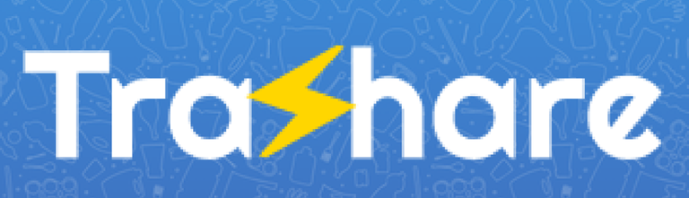
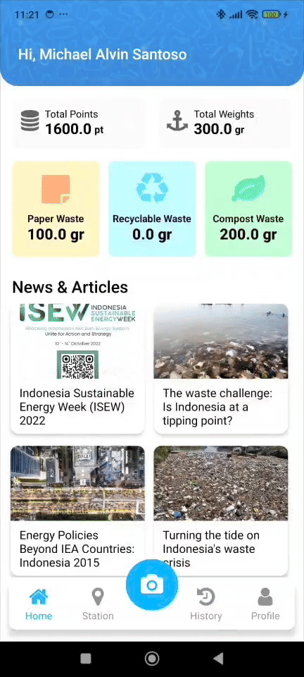
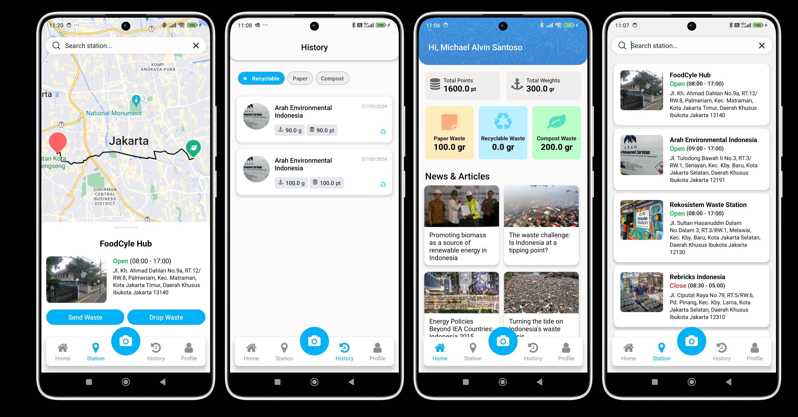

## BlueJacket Team
- Dave Andrew Nathaniel
- Jessica Ryan
- Vincent Tanjaya

## Introduction

Heya! Introducing Trashare

The First Educational Application in Indonesia that empowers you to be part of a sustainable future. Trashare does this by making waste management simple and rewarding. This application will connect you to companies who benefits from sorted trash.

- **Become A Waste Management Pro!**  View personal trash summary to understand you habits and track your progress to a greener lifestyle.

- **Stay Informed and get educated**
   Get access to valuable information and tips on responsible waste disposal and recycling. Our resources and AI will help you on your journey to segregate each trash based on their type.

- **Your hassle-free trash assistant**
   Connect to company in need of certain type of trash, chat with them, order pick up, and drop off transaction with a single tap on your phone!

## Features

- View Personal Trash Summary
- Navigate to Station
- View News and Articles
- View and Edit Profile Image
- Additional Profile Options
- View Station Queue
- Finish Order
- View Order History and their details

## Pre-requisites

- Java SDK (v >=17)
- Expo SDK (v >=50)

## Getting Started (for Android)

1. `npm install`
2. `npm run android`

or

Download the application from APK

## Why Trashare?

- **The first step to create habits in Indonesia to separate trash based on their types**.  
  Trash segregation is important because it allows businesses to recycle more items, preventing them from ending up in the landfill. This, in turn reduces the overall impact of trash on the environment and create a sustainable environment for us in the future. [Many other countries is far ahead of the game](https://waste4change.com/blog/countries-interesting-waste-sorting-culture/) and implemented strict rules about it. These countries have created habit in their people and effective waste management system that encourages people to be more aware about their waste.

- **Why separating trash is important and why Indonesia have not implemented any strict rules about it**.  
  Separating trash is always an ongoing journey problem of Indonesia from the beginning. Certain rules have been implemented in effort to combat this issue, but unfortunately in the moment there is no referee that ensures that focuses on managing this issue and brave enough to give strict punishment for the wrong-doer, even though not segregating trash is proved to be dangerous, sometimes deadly. Read more about how the trash in "Leuwigajah" Landfill created a landslide that causes the death of 150 people [here](https://news.detik.com/berita-jawa-barat/d-4906289/mengenang-tragedi-longsor-sampah-di-tpa-leuwigajah). Indonesian simply doesn't have the habit and knowledge yet on sorting and managing their waste.

- **How trash can be useful and can be generated for profit**.  
  Trash can be used for many things, including bricks, rich soil, energy, recycled back, and many other furniture pieces. You can find these companies try to make a contribution to a greener earth, while creating a functional product out of it. Unfortunately, many of these companies go unnoticed, and their effort become more about mitigating the issue rather than searching for the root cause and prevent the issue in the first place. Also, the sorting process tend to be tedious and took the most time on the recycling process. Trashare create a solution to both of these problem by connecting these companies to user's that have sort their own trash. Companies can share a fraction of the profit from the trash back to the customer. This is a win-win solution for both the customer and the recycling company.

## Preview

## Video Installation Guide & Demo

- https://youtu.be/68yoWxZJ2NE

## FAQ

- **How do I get paid from my sorted trash?**

  - **We sell your trash to trash stations that created who needed it**, this includes trash recycler, biomass energy, rich soil, et cetera.
    This station benefited from your trash, and you will take a fraction of its value. Your trash value is dependent on the trash type and its value
    on the market because not all trash type is valued equally.

- **Why do I need to sort the trash myself and what happens if my trash is not sorted correctly?**

  - **Unsorted trash can be found anywhere, but sorted trash is far more valuable**, this is because when trash stations are recycling, or
    upcycling their trash, it needed to be sorted first. If the company focuses on paper waste, tean compostable waste that can be found will not be processed.
    So, when you yourself sort the trash, you can navigate which trash go to which station, which not only help the recycling team,
    but also maximize your trash potential! If your trash is not sorted correctly, then the driver/the station owner have the option to cancel your order
    because your order cannot be processed. You then can sort your trash and try again.

- **I am having issues on using the app, how to fix it?**
  - **Please contact our customer service support**, for temporary, because we don't have any customer support staff at the moment, you can contact us on email, at trashare.bluejacket@gmail.com

## Future Development

- Collaborate with more companies that manages trash and generates profits from it. Create station customization profile if companies that we manage is > 20
- Create management for drivers, or also provides our own driver to facilitates stations without the ability to hire driver to pickup the trash from user if the user reaches > 100
- Collaborate with advertisement and the government to provide more funding for application maintenance and deployment cost
- Create a deal with entertainment, fashion, and/or fast food companies to get discount/funding for their services as a reward for user with point requirements
- Create pop up stations in universities and exhibition, with sorted and colored garbage can to promote the good habits in students and young people.

## Contact

If you have any questions or want to discuss Trashare further, please feel free to reach out to us at:

- Email: vincent.tanjaya@binus.edu
- Email: jessica.ryan@binus.edu
- Email: dave.nathaniel@binus.edu
